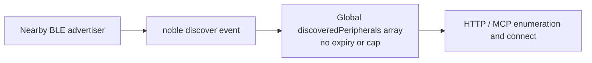
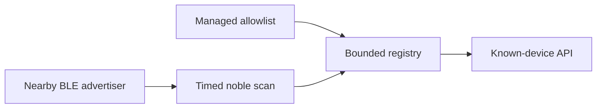

# Security Hardening Proposal: Give BLE discovery state an owned lifetime and capacity

## Decision

We should replace indefinite retention of discovered peripherals with a bounded
registry. I recommend a TTL/LRU registry first; allowlisted on-demand scanning
is the stronger model only where device enrollment is already operationally
owned.

## Executive Recommendation

Option 1, **Bounded TTL/LRU discovery registry**, preserves open discovery while
enforcing entry count and age. Option 2, **Allowlisted on-demand scan**, accepts
only managed devices during explicit scan windows. Both address the finding;
they differ chiefly in product and operations assumptions.

## Evidence

I inspected `ble-manager.js` in the scanned revision. F3 /
`csf_730757dc1b653ba31c4c4037` — **BLE advertisements can grow the
discovered-peripheral cache without bound** — establishes that powered-on state
starts scanning and every unseen identifier is appended to a global array with
no eviction. This is observed source behavior.

## Current Design And Failure Mode

BLE advertising is an untrusted radio boundary. The current array uses the
identifier only to suppress duplicates, then retains the full peripheral object
forever. We can reasonably infer that state lifetime is owned by no component:
there is no capacity policy, clock policy, or cleanup route to audit.

## Desired Invariants

- Retained discovery entries have a configured maximum and expiry.
- Enumeration and lookup are bounded under unique-advertisement churn.
- Expiry behavior is visible and compatible with expected connection timing.

## Constraints And Non-Goals

We are not changing Bluetooth pairing or peripheral authorization in this
proposal. The design must retain the existing formatted discovery API unless we
separately choose an allowlist product model.

## Before Architecture

## Options

### Option 1: Bounded TTL/LRU discovery registry

We replace the array with a `Map` keyed by peripheral ID and retain minimal
metadata plus a last-seen timestamp. On every discovery event, we refresh the
entry, evict expired entries, and evict least-recently-seen entries above a
configurable cap. We should not silently discard a connected peripheral: the
connected-device map remains the authority for an active connection.

This is attractive because it directly bounds the finding while preserving the
existing discovery experience. The tradeoff is that a device may expire between
enumeration and a late connect request. We can make that failure predictable and
ask the client to rescan rather than retain unlimited state.

| Change | Before | After | Security consequence | Cost |
| --- | --- | --- | --- | --- |
| Retention | Infinite array | TTL/LRU Map | Bounded memory | Stale devices can expire |
| Duplicate check | Linear search | Map lookup | Predictable lookup work | Small metadata change |
| Visibility | No eviction signal | Eviction metrics | Capacity tuning possible | Metrics work |

### Option 2: Allowlisted on-demand discovery

We start scanning only for a requested interval and retain only configured
device identities. This reduces radio-input exposure and narrows what the API
reveals. It is appealing in an appliance-style deployment where the fleet is
known, but it makes device enrollment and replacement part of operations.

| Change | Before | After | Security consequence | Cost |
| --- | --- | --- | --- | --- |
| Scan lifecycle | Always on | Requested window | Less untrusted input | First discovery can be slower |
| Device set | Any advertiser | Allowlisted | Stronger exposure reduction | Enrollment operations |

## Comparison

| Dimension | Option 1 | Option 2 |
| --- | --- | --- |
| Security | Bounds state | Bounds state and narrows accepted devices |
| Performance | Likely neutral; unmeasured | Possible scan-start latency |
| Memory | Deterministic cap | Deterministic cap, normally smaller |
| Reliability | Rescan may be needed after expiry | Enrollment errors can block new devices |
| Operability | Tune cap/TTL | Own device lifecycle and scan requests |
| Migration | API-compatible | Changes discovery contract |

## Recommendation

I recommend Option 1 now. It is a direct response to F3 without assuming a
managed fleet. Option 2 becomes preferable if operators already own an accurate
allowlist and the product should never enumerate arbitrary nearby devices.

## Evidence Coverage And Residual Risk

| Evidence | Option 1 | Option 2 | Residual risk |
| --- | --- | --- | --- |
| F3 — unbounded discovery cache | Addresses | Addresses | Cap and TTL need workload-based tuning |

## Migration And Rollout

Ship conservative defaults with eviction counters and logs, then observe a
staging or pilot deployment before tightening them. Preserve the current API
shape for Option 1. Roll back by increasing the cap or TTL temporarily if a
known client depends on a longer discovery lifetime; do not remove the bound.

## Validation Plan

- Feed unique mock advertisements beyond the cap and assert the registry remains
  bounded.
- Advance a fake clock and assert stale, disconnected devices disappear.
- Verify connected peripherals remain usable after discovery-record eviction.
- Benchmark enumeration and lookup under expected and adversarial device counts.

## Implementation Work Packages

1. Add registry abstraction, capacity/TTL configuration, and eviction metrics.
2. Route discovery, enumeration, and connection lookup through the registry.
3. Add churn, expiry, and connected-device regression tests.
4. Document capacity defaults and operational tuning.

## Open Questions

What are the expected maximum visible devices and acceptable rescan interval in
the supported deployments? We should use those answers to set defaults.
