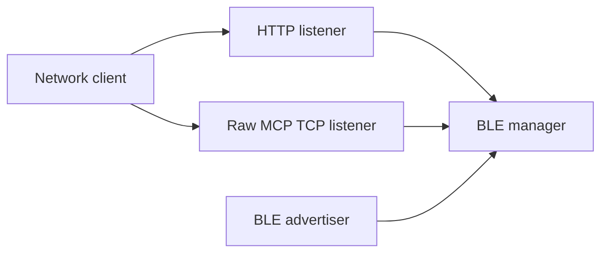
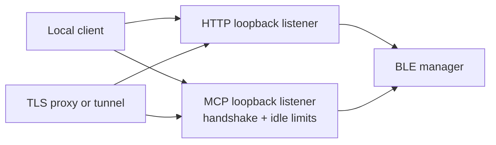
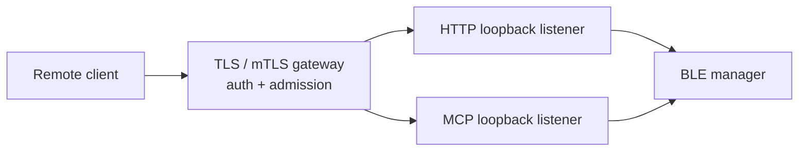

# Security Hardening Proposal: Establish one trusted ingress boundary for BLE authority

## Decision

We need to decide whether remote BLE control remains an implicit side effect of
starting the process, or becomes an explicitly configured and protected service
boundary. I recommend Option 1 now, with a documented TLS deployment path, and
would move to Option 2 when remote MCP access is a normal supported workflow.

## Executive Recommendation

Option 1, **Fail-closed local listeners**, changes the existing process so it
binds to loopback by default, rejects non-loopback startup without both secrets,
accepts REST credentials only in headers, and bounds pre-auth MCP state. Option
2, **Dedicated TLS gateway**, keeps the BLE process local-only and puts all
remote TLS, admission, and transport policy in a distinct component.

Option 1 is the proportionate first move because it removes the insecure default
without forcing a new runtime dependency. Option 2 has the cleaner remote trust
boundary, but its certificate and proxy operations are worth paying for only
when remote clients are a product commitment.

## Evidence

I inspected the affected listeners and BLE call paths in the scanned revision.
The following evidence is observed source behavior, not a runtime measurement.

| Evidence | Finding or document | What it establishes |
| --- | --- | --- |
| F1 / `csf_17b92e19c95170922c9e1161` | Default startup exposes unauthenticated BLE control | `server.js` and `mcp-server.js` make authentication conditional outside production mode while listeners do not explicitly bind loopback. |
| F2 / `csf_d3ce55de93873aa94d30c900` | BLE service credentials are accepted over cleartext transports | REST accepts a query credential and MCP uses raw `net` TCP without process-level TLS. |
| F4 / `csf_f43619fa54f919391a51ead0` | MCP accepts unlimited idle TCP clients | Socket state is created before authentication with no timeout or client cap. |

## Current Design And Failure Mode

Today, the Express and MCP servers each decide independently whether to require
a secret. `NODE_ENV` acts as a proxy for the security decision, but the normal
container and direct startup paths do not set it. That makes safety depend on
deployment convention. The same split ownership leaves raw MCP transport and
connection admission outside a single auditable control point.

## Desired Invariants

- A non-loopback BLE control listener cannot start without credentials and an
  approved protected transport.
- REST credentials never appear in a URL.
- An unauthenticated MCP peer has a bounded handshake lifetime and cannot create
  unbounded retained state.

## Constraints And Non-Goals

We retain loopback development and do not redesign BLE operations or invent a
multi-tenant authorization model. We also should not claim that a reverse proxy
protects MCP unless a supported TLS or mTLS tunnel is actually deployed.

## Before Architecture

The current source exposes two independent listeners directly to the host
network stack. The important edge is that each may reach the same BLE manager
without one owner for remote exposure policy.

## Options

### Option 1: Fail-closed local listeners

We keep the process shape but consolidate configuration validation in a small
shared security-config module. `HOST` and `MCP_HOST` default to loopback. If an
operator selects any non-loopback binding, startup requires both API_KEY and
MCP_TOKEN and an explicit `REMOTE_TRANSPORT=proxy-or-tunnel` acknowledgement;
the process itself still does not expose raw MCP directly. REST removes
`api_key` query support. MCP adds a handshake timer, an idle timer, and bounded
global and pre-auth client counts before command dispatch.

The attractive part is that this is reviewable in the existing codebase and
preserves normal local workflows. Its residual risk is operational: remote
operators must consistently deploy the documented TLS component. We should make
that friction intentional, because it prevents a cleartext remote listener from
being the accidental default.

| Change | Before | After | Security consequence | Cost |
| --- | --- | --- | --- | --- |
| Listener default | Unspecified interface | Loopback | Prevents accidental remote exposure | Remote setup is explicit |
| Auth | Conditional by NODE_ENV | Required for non-loopback | Removes unauthenticated BLE control | Secrets required for remote use |
| Credentials | Header or URL query | Header only | Reduces URL/log leakage | Client adjustment |
| MCP admission | Unlimited idle sockets | Timers and caps | Bounds pre-auth resource use | Rejected excess clients |

Rollback is straightforward: retain the previous environment names for one
release with deprecation warnings, then remove the compatibility branch after
remote deployments have moved behind the approved transport.

### Option 2: Dedicated TLS gateway with local-only services

We make the proxy or gateway a first-class deployment component. It terminates
HTTPS for REST and mTLS/TLS for MCP, applies rate and connection limits, and
forwards only to loopback services. The BLE process has no network-facing mode.

This is the strongest design when remote clients are expected. It gives us one
place to rotate certificates, record remote peer identity, and shed overload
before it reaches the Bluetooth process. What gives me pause is the operational
footprint: availability now depends on gateway configuration and certificate
handling, so we need staging, monitoring, and a clearly owned deployment
artifact before making it mandatory.

| Change | Before | After | Security consequence | Cost |
| --- | --- | --- | --- | --- |
| Remote edge | Application listeners | TLS gateway | One owned remote boundary | Certificate operations |
| Transport | HTTP/raw TCP possible | HTTPS + TLS/mTLS MCP | Protects bearer credentials | Extra hop and configuration |
| Overload | Reaches MCP process | Shed at gateway and process | Better isolation | Additional monitoring |

## Comparison

| Dimension | Option 1 | Option 2 |
| --- | --- | --- |
| Security | Strong default; remote security depends on supported deployment | Strongest remote boundary and centralized policy |
| Performance | No added hop for loopback | TLS and proxy hop; unmeasured |
| Memory | Explicit process connection caps | Gateway adds session buffers; unmeasured |
| Reliability | Fewer components | Better overload isolation but new gateway dependency |
| Operability | Moderate configuration/documentation work | Certificate, gateway, and monitoring ownership |
| Migration | Incremental | Remote client endpoint migration required |

## Recommendation

I recommend Option 1 under the current constraints. It fixes the unsafe default
and creates the same local-only premise that Option 2 needs later. Option 2
should win if remote MCP is part of the supported product interface, or if the
deployment team already operates a standard TLS gateway.

## Evidence Coverage And Residual Risk

| Evidence | Option 1 | Option 2 | Residual risk |
| --- | --- | --- | --- |
| F1 — unauthenticated BLE control | Addresses | Addresses | A deliberately configured loopback dev mode remains locally callable |
| F2 — cleartext credentials | Mitigates via required external TLS | Addresses | Proxy/tunnel must be deployed correctly |
| F4 — idle MCP clients | Addresses | Addresses | Limits need tuning against real clients |

## Migration And Rollout

Introduce the shared configuration validator first, with loopback defaults and
clear startup errors. Then remove query credentials, add MCP limits, and update
systemd, Docker, and README examples. Enable remote access only through a tested
TLS path. Roll back by restoring a previous listener configuration only inside a
trusted network, never by re-enabling unauthenticated non-loopback defaults.

## Validation Plan

- Assert non-loopback startup fails without both secrets.
- Assert unauthenticated REST and MCP BLE commands are rejected.
- Assert API keys in URL queries are rejected.
- Hold sockets through and beyond the handshake/idle deadlines, then verify the
  process releases them and a valid client can connect.
- In staging, capture traffic through the supported remote path and confirm no
  bearer secret appears in cleartext.

## Implementation Work Packages

1. Add shared listener/security configuration and tests.
2. Change HTTP and MCP binding/authentication defaults; remove query credentials.
3. Add MCP timeouts and connection admission limits with metrics.
4. Update deployment assets and document the supported TLS remote path.

## Open Questions

Which component should own remote MCP TLS: an existing mTLS gateway, a local
tunnel, or a new in-process TLS server? The answer determines whether Option 1
is sufficient long-term.
